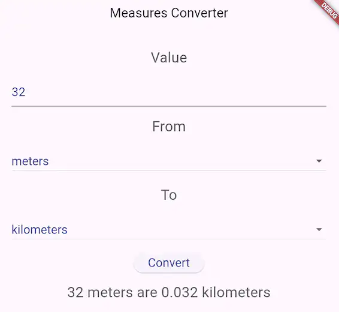

<!-- _class: lead -->
<!-- _class: frontpage -->
<!-- _paginate: skip -->

# Course Project: Unit Conversion

---
> Unit Conversion app converts measurements from one unit to another while maintaining the same quantity.

---

## 1. Data structure

- This application does not have a data structure for simplicity.

---

## 2. Service functions

- The Conversion class has the service function.
- It uses a conversion table. 

<style scoped> 
pre code { font-size: 0.7em !important; line-height: 1.2;} 
</style> 
```
class Conversion {
  static var formulas = {
    '0': [1, 0.001, 0, 0, 3.28084, 0.000621371, 0, 0],
    ...
    '7': [0, 0, 28.3495, 0.0283495, 3.28084, 0, 0.0625, 1],
  };

  Map<String, int> measures = {
    'meters': 0,
    ...
    'ounces': 7,
  };
}

```
---

### convert 

- This function converts one value to another using the conversion table. 
```
double convert(double value, String from, String to) {
  int nFrom = measures[from]!;
  int nTo = measures[to]!;
  var multiplier = Conversion.formulas[nFrom.toString()]![nTo];
  return value * multiplier;
}
```
---

## 3. User Interface

- main.dart
---

### main.dart



----
- It has the classic Flutter program structure.

```
void main() {
  runApp(MaterialApp(
    title: 'Measures Converter',
    home: MyApp(),
  ));
}
class MyApp extends StatefulWidget {
  MyAppState createState() => MyAppState();
}
class MyAppState extends State<MyApp> {
  Widget build(BuildContext context) {...}
}  
```

---

#### Widget structure

```
return Scaffold(
  appBar: AppBar(
    title: Text('Measures Converter'),
  ),
  body: Container(
    child: SingleChildScrollView(
      child: Column(
        children: [
          Text(...),
          TextField(...), 
          Text(...),
          DropdownButton(...),
          Text(...),
          DropdownButton(...),
          ElevatedButton(...),
          Text(...),
          ),
        ],
      ),
    )
```
---

#### Scaffold: appBar

- The AppBar has a simple header text. 
```
appBar: AppBar(
  title: Text('Measures Converter'),
),
```
---

#### Scaffold: body

- The body has
  - One TextField to get input from users.
  - Two DropdownButtons to choose the units.
  - One ElevatedButton to start the conversion. 
  - Four Texts. 
--- 

#### TextField

```
TextField(
  style: inputStyle,
  decoration: InputDecoration(
    hintText: "Please insert the measure to be converted",
  ),
  onChanged: (text) {
    setState(() {
      _numberFrom = double.parse(text);
    });
  },
),
```
---

#### DropdownButton

```
DropdownButton(
  isExpanded: true,
  style: inputStyle,
  value: _startMeasure,
  items: _measures.map((String value) {
    return DropdownMenuItem<String>(
      value: value,
      child: Text(
        value,
        style: inputStyle,
      ),
    );
  }).toList(),
  onChanged: (value) {
    onStartMeasureChanged(value as String);
  },
),
```
---

#### ElevatedButton

```
ElevatedButton(
  child: Text('Convert', style: inputStyle),
  onPressed: () => convert(),
),
```

---

## 4. Program Structure

- This app does not use software architecture.
- It uses a simple UI with service functions.

```
lib
├── main.dart
└── util
    └── convert_util.dart
```
---

## Self-grading for HW 

<style scoped> 
li { font-size: 0.8em !important; line-height: 1.2;} 
</style> 

- You can analyze the code on your own (30%).
- You analyze the whole code twice using a different method (60%).
    - Make a summary of widgets you did not know before (what and how to use them). 
- You understand how the code works (80%).
- You can use the programming techniques in this example to make team and individual projects (100%). 


 
