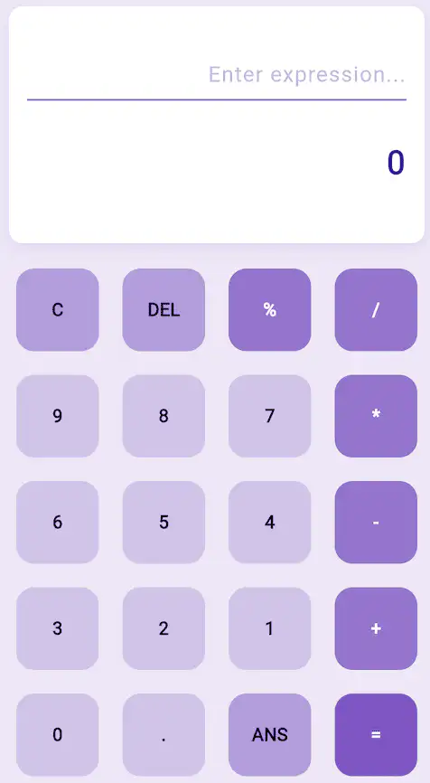

# Course Project: ...
---
> Calculator mimics a real-world calculator.

---
## 1. Data structure
- This application does not have a data structure for simplicity.
---

## 2. Service functions
- calculateExpression
- \_formatResult
- \_is functions
- \_get functions
- pressedButton
---
### calculateExpression
- Instead of parsing a user expression using a lexer and a parser, we use an existing library. 
- We need to add the math_expression package to the dependencies
```
dependencies:
  ...
  math_expressions: ^2.3.0 
```

---
- We import the library before we use the functions. 
```
import 'package:math_expressions/math_expressions.dart';

void calculateExpression() {
    ExpressionParser parser = GrammarParser();
    Expression expression = parser.parse(userQuestion);
    var context = ContextModel();
    double result = expression.evaluate(EvaluationType.REAL, context);
}
```
---
- We need to redraw the GUI and use setState to trigger the build functions. 

```
setState(() {
 userAnswer = _formatResult(result);
});

```
---
### \_formatResult
- After the arithmetic computation, the results can be lengthy or end with a dot.

```
"5.000000" → "5."
"3.140000" → "3.14"
"5." → "5"
"10." → "10"
```
---
- The \_formatResult function uses a regular expression to format the result.
```
String _formatResult(num result) {
  if (result == result.toInt()) {
    return result.toInt().toString();
  } else {
    return result
        .toStringAsFixed(6)
        .replaceAll(RegExp(r'0*$'), '')
        .replaceAll(RegExp(r'\.$'), '');
  }
}
```
---
### \_is functions
- We can check if a certain button is an operator or a specific key.
```
bool _isOperator(String button) {
  return ['+', '-', '*', '/', '%'].contains(button);
}

bool _isSpecial(String button) {
  return ['C', 'DEL', '=', 'ANS'].contains(button);
}
```
---
### \_get functions
- Based on the \_is functions, we can choose the color.
- \_getButtonColor function returns the color for each operator. 
```
Color _getButtonColor(String button) {
  if (button == '=') {
    return Colors.deepPurple[400]!;
  } else if (_isOperator(button)) {
    return Colors.deepPurple[300]!;
...
}
```
---
- We can get text color likewise. 
```
Color _getTextColor(String button) {
  if (button == '=' || _isOperator(button)) {
    return Colors.white;
  } else {
    return Colors.black;
  }
}
```

---
### pressedButton
- This function interprets the button to display numbers or compute. 
- It uses the setState function to redraw widgets.
<style scoped> 
pre code { font-size: 0.5em !important; line-height: 1.2;} 
</style> 

```
void pressedButton(String button) {
  setState(() {
    if (button == 'C') { ...
    } else if (button == 'DEL') { ...
    } else if (button == '=') {
      calculateExpression();
    } else if (button == 'ANS') {
      userQuestion += userAnswer;
    } else {
      userQuestion += button;
    }
  });
}
```
---
## 3. User interface
- main.dart
- MyButton (button.dart)

---

### main.dart



----
- It has the classic Flutter program structure.

```
void main() => runApp(const MyApp());
class MyApp extends StatelessWidget {
  Widget build(BuildContext context) {
    return const MaterialApp(home: HomePage(),);
  }
}
class HomePage extends StatefulWidget {
  State<HomePage> createState() => _HomePageState();
}
class _HomePageState extends State<HomePage> {...}
```

---
####  Widget structure
- It is a column structure with two sections: display and button. 
```
return Scaffold(
  body: Column(
    children: [
      // Display Section
      Expanded(...)
      // Buttons Section
      Expanded(...)
    ]
  )
```
---
##### Display section
- The display section has a column structure with two texts for user expression and output display.
```
child: Container(
  child: Column(
    children: [
      // Show expression
      Container(child: Text(...),),
      // Output Section
      Container(child: Text(...),),
    ],
  ),
),
```
---
##### Button section
- It uses GridView.builder to generate 4-column buttons.
```
child: Container(
  child: GridView.builder(
    itemBuilder: (context, index) { 
      return MyButton( ... );
    },
  ),
```
---
- In the itemBuilder, it gets the button, color, and action when pressed. 
```
itemBuilder: (context, index) {
  return MyButton(
    child: buttons[index],
    buttonColor: _getButtonColor(buttons[index]),
    textColor: _getTextColor(buttons[index]),
    function: () {
      pressedButton(buttons[index]);
    },
  );
```
---
- The calculator prevents scrolling with NeverScrollableScrollPhysics.
- With SliverGridDelegateWithFixedCrossAxisCount, the four-width column is set. 
```
physics: const NeverScrollableScrollPhysics(),
gridDelegate: const SliverGridDelegateWithFixedCrossAxisCount(
  crossAxisCount: 4,
  ...
),
```
---
### MyButton (button.dart)
#### Widget Structure
- We need a rounded rectangular button.
```
child: ClipRRect(
  borderRadius: BorderRadius.circular(20),
  child: Container(
      height: 100, width: 100,
      color: buttonColor,
      child: Center(child: Text(...)),
),
```
---
##### ClipRRect widget
- ClipRRect is a Flutter widget that clips its child using rounded rectangles.
- It creates a rounded rectangular clipping area for its child widget, making corners rounded and hiding any content that extends beyond those boundaries

---
## 4. Program structure
- This application does not use any software architecture.
- The code is simple but looks complicated due to the decorations. 
```
.
├── button.dart
└── main.dart
```
---
## Self-grading for HW 
<style scoped> 
li { font-size: 0.8em !important; line-height: 1.2;} 
</style> 

- You analyze the whole code once (30%).
- You analyze the whole code twice using a different method (60%).
    - Make a summary of widgets that you did not know before (what and how to use them). 
- You understand how the code works (80%).
- You can use the programming techniques in this example to make team and individual projects (100%). 


 
