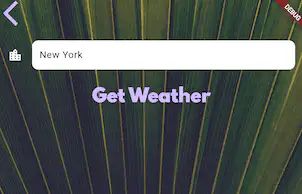

# P4. Weather
---
> - Weather is a weather app to get weather information around the world.
> - Using this app, we can check the weather locally or anywhere.

---

## 1. Data structure
- This application does not use a special data structure.
- It uses Json format received from the weather API server. 

## 2. Service functions
- NetworkHelper (networking.dart)
- Location (location.dart)
- WeatherModel (weather.dart)
---
### geolocator package
- This app requires the geolocator package. 
```
dependencies:
  geolocator: ^14.0.1

import 'package:geolocator/geolocator.dart';
```
---
### NetworkHelper (networking.dart)
- This class is a helper class that retrieves information using a URL.

<style scoped> 
pre code { font-size: 0.5em !important; line-height: 1.2;} 
</style> 

```
class NetworkHelper {
  NetworkHelper(this.url);

  final String url;

  Future getData() async {
    http.Response response = await http.get(Uri.parse(url));
    if (response.statusCode == 200) {
      String data = response.body;
      return jsonDecode(data);
    } else {
      print(response.statusCode);
      throw 'Problem with the get request!';
    }
  }
}
```

---
### Location (location.dart)
- The Location class has two service functions
```
import 'package:geolocator/geolocator.dart';

class Location {
  double latitude = 0.0;
  double longitude = 0.0;

  Future<Position> _determinePosition() async { ... }
  Future<void> getCurrentLocation() async {...}
}  
```
---
#### \_determinePosition
- This function gets permission from the platform and gets the current position. 
```
Future<Position> _determinePosition() async {
  bool serviceEnabled;
  LocationPermission permission;

  serviceEnabled = await Geolocator.isLocationServiceEnabled();
  permission = await Geolocator.checkPermission();
  if (permission == LocationPermission.denied) {
     ...
  }
  Return await Geolocator.getCurrentPosition();
}
```
---
#### getCurrentLocation
- This function gets the current location from \_determinePosition to set the location values in the Location class. 

<style scoped> 
pre code { font-size: 0.7em !important; line-height: 1.2;} 
</style> 

```
Future<void> getCurrentLocation() async {
  try {
    var p = await _determinePosition();
    this.latitude = p.latitude;
    this.longitude = p.longitude;
    print('latitude: $latitude, longitude: $longitude');
  } catch (e) {
    print('$e -> Something is wrong!');
  }
}
```
---
### WeatherModel (weather.dart)
- The WeatherModel class has four service functions.
    - getCityWeather
    - getLocationWeather
    - getWeatherIcon
    - getMessage
----
#### getCityWeather
- It returns the weather information from the weather API server. 
```
Future<dynamic> getCityWeather(String cityName) async {
  var str = '$openWeatherMapURL?q=$cityName&appid=$apiKey&units=imperial';
  print(str);
  NetworkHelper networkHelper = NetworkHelper(str);

  var weatherData = await networkHelper.getData();
  return weatherData;
}
```
---
#### getLocationWeather
- It gets (1) the current location, (2) creates a URI string, and (3) retrieves the weather information.

```
Future<dynamic> getLocationWeather() async {
  Location location = Location();
  await location.getCurrentLocation(); <-- (2) Location.

  var str =
      '$openWeatherMapURL?lat=${location.latitude}... <--- (2) URI string
  try {
    NetworkHelper networkHelper = NetworkHelper(str);
    var weatherData = await networkHelper.getData(); <--- (3) retrieve
  } catch (e) {
    print('Error! $e');
  }
}
```
---
#### getWeatherIcon
- It returns the corresponding icon from the condition. 
```
String getWeatherIcon(int condition) {
  if (condition < 300) {
    return ...;
  } else if (condition < 400) {
    return ...;
  ...
  } else if (condition <= 804) {
    return ...;
  } else {
    return ...;
  }
}
```
---
#### getMessage
- It returns the message from the temp. 
```
String getMessage(int temp) {
  if (temp > 25) {
    return 'It\'s time';
  ...
  } else {
    return 'Bring a just in case';
  }
}
```

---
## 3. User interface
<style scoped> 
li { font-size: 0.9em !important; line-height: 1.5;} 
</style> 
- main.dart
- LoadingScreen (loading_screen.dart)
- LocationScreen (location_screen.dart)
- CityScreen (city_screen.dart)

---
### main.dart

 

----
- It has a straightforward stateless Flutter program structure.
- It doesn't store any states; it only gets Json data from the weather server. 

<style scoped> 
pre code { font-size: 0.7em !important; line-height: 1.2;} 
</style> 

```
void main() => runApp(MyApp());

class MyApp extends StatelessWidget {
  @override
  Widget build(BuildContext context) {
    return MaterialApp(
      theme: ThemeData.dark(),
      home: LoadingScreen(),
    );
  }
}
```

---
### LoadingScreen (loading_screen.dart)
- When the program starts, we will see a screen with a white, animated double-bouncing circle.
- The animation continuously loops, giving users a visual cue that something is loading.
---
```
Widget build(BuildContext context) {
  return Scaffold(
    body: Center(
      child: SpinKitDoubleBounce(
        color: Colors.white,
        size: 100.0,
      ),
    ),
  );
}
```
---
#### getLocationData
- It retrieves weather information to switch to the LocationScreen widget. 
<style scoped> 
pre code { font-size: 0.8em !important; line-height: 1.2;} 
</style> 
```
void getLocationData() async {
  var weatherFuture = WeatherModel().getLocationWeather();
  var minimumDelay = Future.delayed(Duration(seconds: 2));
  var results = await Future.wait([weatherFuture, minimumDelay]);
  var weatherData = results[0];

  if (mounted) {
    Navigator.push(context, MaterialPageRoute(builder: (context) {
      return LocationScreen(locationWeather: weatherData);
    }));
  }
}
```
----
### LocationScreen (location_screen.dart)
- It has a three-row structure. 
    - The first row has two TextButtons to get input from users.
    - The second row has two Texts to display the results.
    - The third row has another Text to display information. 
---
#### widget structure
```
return Scaffold(
  body: Container(
    child: SafeArea(
      child: Column(
        children: <Widget>[
          Row( // first row two TextButton
            children: <Widget>[TextButton(...), TextButton(...),],
          ),
          Padding(
            child: Row( // second row two texts
              children: <Widget>[Text(...), Text(...),],
            ),
          ),
          Padding( // last 
            child: Text(...),
          ),
        ],
      ),
    ),
  ),
);
```
---
##### First row with two TextButtons
- The first TextButton is to get the weather information of the current location.
```
TextButton(
  onPressed: () async {
    var weatherData = await weather.getLocationWeather();
    updateUI(weatherData);
  },
```
---
- The second TextButton is to switch to the CityScreen. 
```
TextButton(
  onPressed: () async {
    var typedName = await Navigator.push(
      context,
      MaterialPageRoute(
        builder: (context) {
          return CityScreen();
        },
      ),
    );
```
---
##### Second row with two Texts
- The second row shows the temperature with an icon. 
```
children: <Widget>[
  Text(
    '$temperature°',
    style: kTempTextStyle,
  ),
  Text(
    weatherIcon,
    style: kConditionTextStyle,
  ),
],
```
---
##### Third row with a Text
- This text contains the weather message and the name of the city. 
```
child: Text(
  '$weatherMessage in $cityName',
  textAlign: TextAlign.right,
  style: kMessageTextStyle,
),
```
---
#### updateUI
- This function redraws widgets after updating weather information. 
<style scoped> 
pre code { font-size: 0.9em !important; line-height: 1.2;} 
</style> 
```
void updateUI(dynamic weatherData) {
  setState(() {
    ...
    double temp = weatherData['main']['temp'];
    temperature = temp.toInt();
    var condition = weatherData['weather'][0]['id'];
    weatherIcon = weather.getWeatherIcon(condition);
    weatherMessage = weather.getMessage(temperature);
    cityName = weatherData['name'];
  });
}
```
---
### CityScreen (city_screen.dart)



---
#### SafeArea

- Modern phones have irregular screen shapes and system UI elements** that can overlap with your app content:
- We can use SafeArea as invisible padding that automatically adjusts based on the device:

#### Widget Structure
- It is a column with a text button (<), a text field, and a text button ("Get Weather").
```
return Scaffold(
  body: Container(
    constraints: BoxConstraints.expand(),
    child: SafeArea(
      child: Column(
        children: <Widget>[TextButton(...), TextField(...), TextButton(...)],
      ),
    ),
  ),
);
```
---
#### First TextButton (<)
- When the button is pressed, it returns to the caller widget. 
```
child: TextButton(
  onPressed: () {
    Navigator.pop(context);
  },
  child: Icon(
    Icons.arrow_back_ios,
    size: 50.0,
  ),
),
```
---
#### Second TextField
```
child: TextField(
  style: TextStyle(
    color: Colors.black,
  ),
  decoration: kTextFieldInputDecoration,
  onChanged: (value) {
    cityName = value;
  },
),
```
---
#### Third TextButton("Get Weather")
```
TextButton(
  onPressed: () {
    Navigator.pop(context, cityName);
  },
  child: Text(
    'Get Weather',
    style: kButtonTextStyle,
  ),
),
```
---
## 3. Program Structure
- This application does not use software architecture for simplifying the structure.
    - The services directory contains the service functions.
    - The screens directory contains the widget pages. 
---
<style scoped> 
pre code { font-size: 0.9em !important; line-height: 1.2;} 
</style> 
```
.
├── fonts
│   └── SpartanMB-Black.otf
├── images
│   ├── city_background.jpg
│   └── location_background.jpg
├── lib
│   ├── generated_plugin_registrant.dart
│   ├── main.dart
│   ├── screens
│   │   ├── city_screen.dart
│   │   ├── loading_screen.dart
│   │   └── location_screen.dart
│   ├── services
│   │   ├── location.dart
│   │   ├── networking.dart
│   │   └── weather.dart
│   └── theme
│       └── constants.dart
└── pubspec.yaml
```

---
## Self-grading for HW 
<style scoped> 
li { font-size: 0.8em !important; line-height: 1.2;} 
</style> 

- You analyze the whole code once (30%).
- You analyze the whole code twice using a different method (60%).
    - Make a summary of widgets that you did not know before (what and how to use them). 
- You understand how the code works (80%).
- You can use the programming techniques in this example to make team and individual projects (100%). 


 
