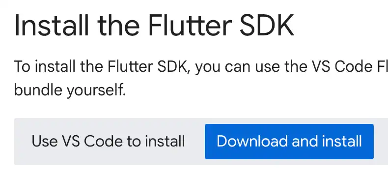
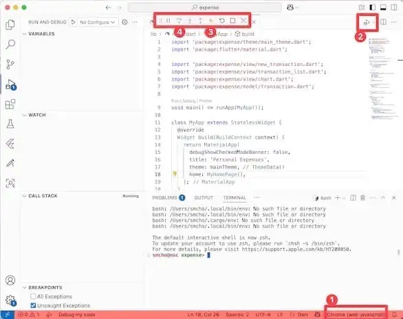
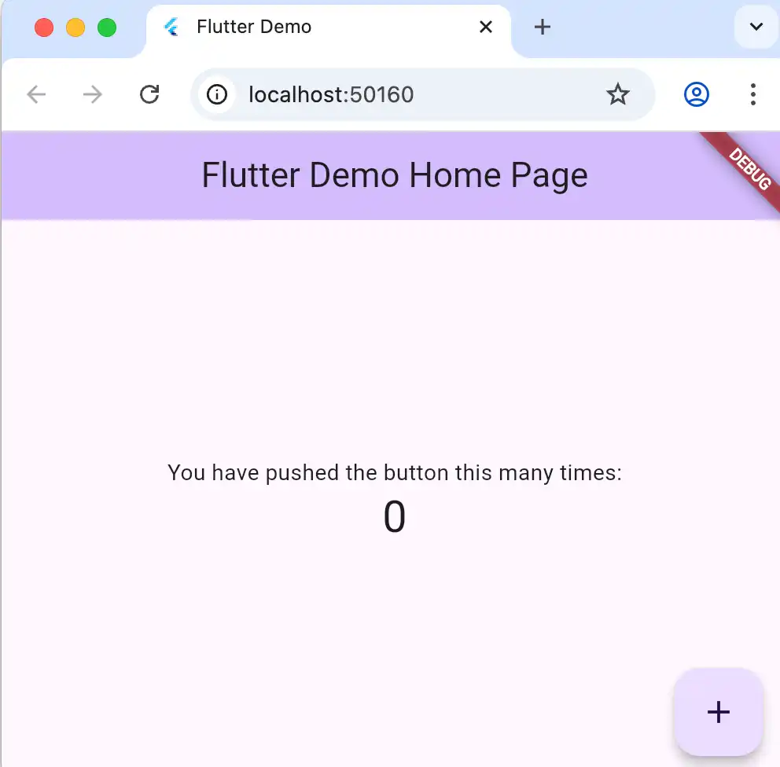
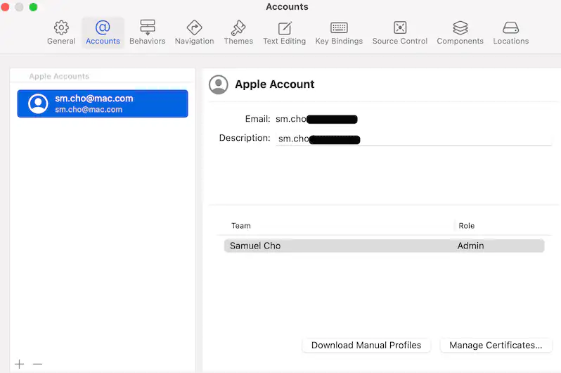
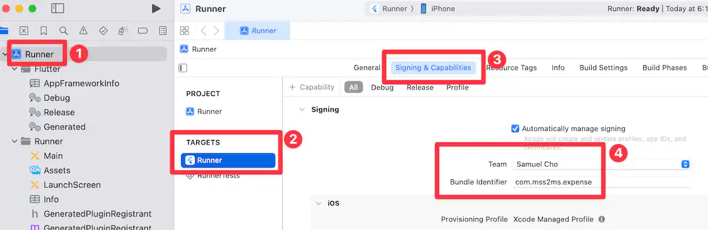
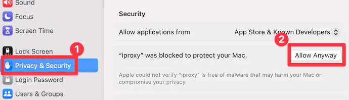
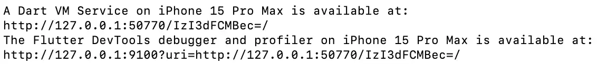

<!-- _class: frontpage -->
<!-- _paginate: skip -->
<!-- _class: lead -->

# Flutter Installation

---

## Cross-platform Flutter SDK

- Flutter requires many installations and configurations.
- Because it is a cross-platform development tool, it requires installing tools for iOS, Android, and Web apps.

---

### Download Flutter SDK

- <https://docs.flutter.dev/get-started/>
- Choose your environment and download the SDK.
- Follow the instructions.

<br>



---

#### The Dart Language

- Dart is the programming language the Flutter SDK uses.
- Dart is automatically installed with the Flutter SDK.

##### You already know Dart

- It is a hybrid of Java and JavaScript.
- It has many Python-like features.
- It has the features that are good for cross-platform development.

---

#### Use VSCode for Dart/Flutter Programming

**In many cases, using VS Code can be the simplest way to install Flutter.**

- Visit [https://docs.flutter.dev/install/with-vs-code](https://docs.flutter.dev/install/with-vs-code) to use VSC.
- Install Dart and Flutter VSCode extensions.
- There are many other extensions for Dart/Flutter application development; choose them for your purposes.

---

- Use VSCode Dart/Flutter extensions to run and debug applications.



---

#### Flutter doctor

- When the installation is finished, execute `flutter doctor` in the command line.

```txt
> flutter doctor

Doctor summary (to see all details, run flutter doctor -v):
[✓] Flutter 
[✓] Android toolchain 
[✓] Xcode - develop for iOS and macOS (Xcode 16.4)
[✓] Chrome - develop for the web
[✓] Android Studio (version 2023.1)
[✓] IntelliJ IDEA Ultimate Edition (version 2023.3.2)
[✓] VS Code (version 1.100.2)
• No issues found!
```

---

### When you have any issues

**We need to install many tools to use Flutter, so we may likely have some issues with the installation.**

- Remember you are the `problem solver`.
- Develop your debugging skills as a `professional software engineer`.
- `Start early` to identify the issues as early as possible

---

#### Ask for help

- You don't have much time to lose, especially for the installation.
- Ask other team members who successfully installed Flutter.
- Use my office hours to visit and ask.

---

#### Discuss the issue with LLM

- AI/LLM can solve your installation issues effectively.
- Copy the error message to LLM.
- Use multiple LLMs when one LLM doesn't give you the correct answers.

---

- In the AI age, your time is more important than AI time.
- Make LLM as your `junior` software engineer, you being the `senior` software engineer: not the way round.
- It's dangerous if you follow LLM's orders to solve problems.

---

## Make first Flutter app

- Create a directory to host a Flutter app.
- `flutter create` command to create a Flutter project.

<br>

```txt
> flutter create my_first_app
All done!
```

---

### Flutter run

**Flutter asks you to choose the platform to run.**

- The output should be different depending on your configuration.
- In this example, I use a Mac and connected a Pixel Google phone and an iPhone.

```txt
> cd my_first_app
> flutter run

[1]: Pixel 3a (941AY0HQM5)
[2]: iPhone 15 Pro Max (F31F-4002-8103-7D96CD8)
[3]: macOS (macos)
[4]: Chrome (chrome)
```

---

#### Choose Chrome

- You will see the Web App start.



---

#### Hot Reload

- You don't have to restart when you develop a Flutter application.
- You can type `r` in the command line to reload and restart your application.

---

#### Choose iOS or Android

- Depending on your situation, choose iOS when you have an iPhone, and Android when you have an Android phone.

#### For iOS

- Choose iPhone (only when you have a connected iPhone)
- You must use Xcode to open the Xcode project (Runner.xcodeproj) in the iOS directory.
- You also have to join the Apple Developer Program.

---

- To build iOS/Mac applications, we must use Signing & Capabilities to download and register the certificate.

<br>



---



---

- You need to allow the apps that should be executed through Privacy & Security.



---

### Debugging the App

- You can use VSC for debugging.
- You can also use a web browser to monitor and debug code.



---

#### For Android

- Choose Android Phone (in this example, Google Pixel).
- It installs necessary files, builds the code, and runs on Android.
- You can also use a web browser to monitor and debug code.

---

#### Developer Mode On

- For both iOS and Android, be sure to turn on `Developer mode`.
- For deploying (selling) your app:
  - With iOS, register for the Developer program ($99/year)
  - With Android, use the Google Store.

---

### Simulators

Flutter can use the Simulator for both iOS and Android.

- They are slow, and Android requires more setup and configuration.
- Before releasing the application, we must test it on real mobile devices.
