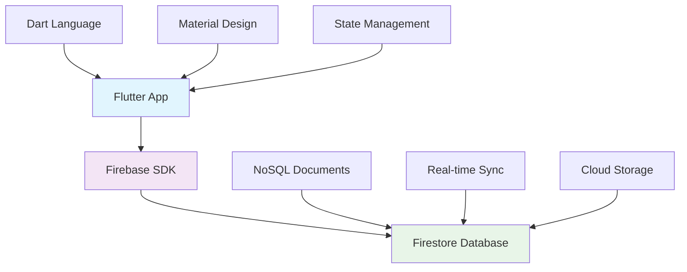

# **Flutter & Firebase Integration**
## Building Cross-Platform Apps with Cloud Database

### Foobar Flutter Application Demo
**Course**: ASE456 - Database Systems  
**Topic**: NoSQL Database Integration  
**Platform**: Flutter + Firebase Firestore

---

## **Learning Objectives**

By the end of this session, students will understand:

🎯 **Flutter-Firebase Integration**
- Setting up Firebase in Flutter applications
- Configuring Firestore for cross-platform development

🎯 **Async Programming Patterns**  
- Using async/await in Dart
- Handling asynchronous database operations

🎯 **NoSQL Database Concepts**
- Document-based data storage
- Real-time data synchronization

🎯 **Modern App Development**
- State management in Flutter
- Error handling and user experience

---

## **What We're Building**

### **Foobar Generator App**

**Core Features:**
- 🎲 Generate random "foobar" data combinations
- ☁️ Store data in Firebase Firestore (cloud database)
- 📱 Real-time UI updates showing saved data
- 📊 History tracking of recent generations
- ⚡ Cross-platform: Web, iOS, Android

**Educational Value:**
- Demonstrates complete database integration workflow
- Shows modern async programming patterns
- Real-world cloud database usage

---

## **Technology Stack Overview**



**Frontend**: Flutter (Dart) - Single codebase for all platforms  
**Backend**: Firebase Firestore - Managed NoSQL cloud database  
**Integration**: Firebase SDK - Handles authentication, networking, caching

---

## **Data Structure Design**

### **Document Schema**
```json
{
  "foo": "hello",           // Random string value
  "bar": 42,                // Random number (1-100)
  "timestamp": 1672531200000 // Creation timestamp
}
```

### **Collection Structure**
```
foo_flutter_test/          # Collection name
├── doc_abc123            # Auto-generated document ID
│   ├── foo: "dart"
│   ├── bar: 73
│   └── timestamp: 1672531200000
├── doc_def456
│   ├── foo: "firebase"
│   ├── bar: 28  
│   └── timestamp: 1672531260000
```

**Key Concepts**: Documents, Collections, Auto-generated IDs, Flexible Schema

---

## **Application Architecture**

### **Three-Layer Architecture**

```
┌─────────────────────────────────┐
│        Presentation Layer       │  ← UI Components & User Interaction
│  • Status Cards                 │
│  • Data Display                 │
│  • History List                 │
│  • Loading States               │
└─────────────────────────────────┘
┌─────────────────────────────────┐
│       Business Logic Layer      │  ← Core Application Logic
│  • Data Generation              │
│  • State Management             │
│  • Error Handling               │
└─────────────────────────────────┘
┌─────────────────────────────────┐
│       Data Access Layer         │  ← Database Operations
│  • Firebase Integration         │
│  • Document CRUD Operations     │
│  • Connection Management        │
└─────────────────────────────────┘
```

---

## **Code Deep Dive: Data Generation**

### **Random Data Generator**
```dart
Map<String, dynamic> generateRandomData() {
  final random = Random();
  
  // Predefined string options for "foo"
  final fooOptions = ['abc', 'xyz', 'hello', 'world', 'dart', 'firebase'];
  final randomFoo = fooOptions[random.nextInt(fooOptions.length)];
  
  // Random number for "bar"
  final randomBar = random.nextInt(100) + 1;  // 1 to 100
  
  return {
    "foo": randomFoo,
    "bar": randomBar,
    "timestamp": DateTime.now().millisecondsSinceEpoch,
  };
}
```

**Teaching Points:**
- Clean separation of data generation logic
- Predictable random values for testing
- Timestamp for data tracking

---

## **Code Deep Dive: Firebase Operations**

### **Save to Firestore**
```dart
Future<void> _generateAndSaveFoobar() async {
  final firestore = FirebaseFirestore.instance;
  
  try {
    // 1. Generate data
    final newData = generateRandomData();
    
    // 2. Save to Firestore
    DocumentReference docRef = await firestore
        .collection('foo_flutter_test')
        .add(newData);
    
    // 3. Retrieve saved document for confirmation
    DocumentSnapshot docSnapshot = await docRef.get();
    
    // 4. Update UI with results
    if (docSnapshot.exists) {
      Map<String, dynamic> savedData = docSnapshot.data() as Map<String, dynamic>;
      // Update state...
    }
  } catch (e) {
    // Handle errors gracefully
  }
}
```

---

## **State Management Pattern**

### **Flutter State Variables**
```dart
class _MyHomePageState extends State<MyHomePage> {
  // Current data display
  String _currentFoo = '';
  int _currentBar = 0;
  String _currentDocId = '';
  
  // UI state
  bool _isLoading = false;
  String _statusMessage = 'Click button to generate data!';
  
  // History tracking
  List<Map<String, dynamic>> _dataHistory = [];
}
```

### **State Update Pattern**
```dart
setState(() {
  _currentFoo = savedData['foo'];
  _currentBar = savedData['bar'];
  _currentDocId = docRef.id;
  _statusMessage = 'Data saved successfully!';
  _isLoading = false;
});
```

---

## **User Interface Components**

### **Status Card** - Operation Feedback
```dart
Card(
  color: Colors.blue.shade50,
  child: Column(
    children: [
      Icon(_isLoading ? Icons.sync : Icons.info_outline),
      Text(_statusMessage),
    ],
  ),
)
```

### **Current Data Card** - Show Latest Values  
```dart
Card(
  color: Colors.green.shade50,
  child: Column(
    children: [
      Text('foo: "$_currentFoo"'),
      Text('bar: $_currentBar'),
      Text('Doc ID: $_currentDocId'),
    ],
  ),
)
```

**UI Principles**: Visual feedback, loading states, clear data presentation

---

## **Error Handling Strategy**

### **Comprehensive Error Management**
```dart
try {
  // Database operations
  DocumentReference docRef = await firestore.collection('test').add(data);
  
} catch (e) {
  print("Error occurred: $e");  // Console logging for developers
  
  setState(() {
    _statusMessage = 'Error: ${e.toString()}';  // User-friendly message
    _isLoading = false;  // Reset loading state
  });
  
  // Optional: Analytics tracking, retry logic, fallback behavior
}
```

**Error Categories:**
- **Network Issues**: Connectivity problems, timeouts
- **Permission Errors**: Firestore security rule violations  
- **Configuration**: Firebase setup problems
- **Data Validation**: Invalid document structure

---

## **Async Programming Concepts**

### **The Problem with Synchronous Code**
```dart
// ❌ This blocks the UI thread
void badExample() {
  var data = generateData();           // Instant
  var result = database.save(data);    // Takes 2 seconds - UI freezes!
  updateUI(result);                    // Finally executes
}
```

### **The Async/Await Solution**
```dart
// ✅ This keeps UI responsive
Future<void> goodExample() async {
  setState(() => _isLoading = true);   // Show loading immediately
  
  var data = generateData();           // Instant
  var result = await database.save(data); // Non-blocking wait
  
  setState(() {                        // Update UI when ready
    _isLoading = false;
    updateUI(result);
  });
}
```

---

## **Firebase Setup Process**

### **1. Firebase Project Creation**
1. Go to [Firebase Console](https://console.firebase.google.com)
2. Create new project
3. Enable Firestore Database
4. Configure security rules

### **2. Flutter Configuration**
```bash
# Install Firebase CLI
npm install -g firebase-tools

# Install FlutterFire CLI  
dart pub global activate flutterfire_cli

# Configure project
flutterfire configure
```

### **3. Add Dependencies**
```yaml
dependencies:
  firebase_core: ^2.24.2
  cloud_firestore: ^4.13.6
  firebase_core_web: ^2.10.0      # For web support
  cloud_firestore_web: ^3.8.10    # For web support
```

---

## **Security Considerations**

### **Development vs Production Rules**

**Development (Open Access)**:
```javascript
rules_version = '2';
service cloud.firestore {
  match /databases/{database}/documents {
    match /{document=**} {
      allow read, write: if true;  // ⚠️ Anyone can access
    }
  }
}
```

**Production (Secure Access)**:
```javascript
rules_version = '2';
service cloud.firestore {
  match /databases/{database}/documents {
    match /foo_flutter_test/{document} {
      allow read, write: if request.auth != null;  // ✅ Authenticated users only
      allow create: if validateData(request.resource.data);
    }
  }
}
```

---

## **Demo Time!** 🚀

### **Let's see it in action:**

1. **Launch Application**
   - `flutter run -d chrome`
   - Application loads with initial state

2. **Generate Data**
   - Click "Generate Foobar" button
   - Watch loading states and status updates

3. **View Results**
   - See generated data displayed in cards
   - Check history list for previous generations

4. **Verify in Firebase**
   - Open Firebase Console
   - Navigate to Firestore Database
   - Confirm documents are created

---

## **Common Issues & Solutions**

### **Problem: gRPC Error on Web**
```
Error: gRPC Error (code: 14, codeName: UNAVAILABLE)
```
**Solution**: Ensure web-specific Firebase packages are installed
```yaml
dependencies:
  firebase_core_web: ^2.10.0
  cloud_firestore_web: ^3.8.10
```

### **Problem: "DefaultFirebaseOptions not found"**  
**Solution**: Run Firebase configuration
```bash
flutterfire configure
```

### **Problem: Permission Denied**
**Solution**: Update Firestore security rules to allow access

### **Problem: App Won't Build**
**Solution**: Clean and rebuild
```bash
flutter clean && flutter pub get && flutter run
```

---

## **Real-World Applications**

### **Where This Pattern Is Used:**

🏪 **E-commerce Apps**
- Product catalog management
- Order tracking and history
- User preferences and cart storage

📱 **Social Media Platforms**
- Post creation and storage
- User profiles and activity feeds
- Real-time messaging systems

📊 **Business Applications**  
- Customer relationship management
- Inventory tracking systems
- Analytics and reporting tools

🎮 **Gaming Applications**
- Player profiles and achievements
- Game state synchronization
- Leaderboards and statistics

---

## **Extension Opportunities**

### **Next Steps for Advanced Learning:**

🔐 **Add Authentication**
- Firebase Auth integration
- User-specific data isolation
- Role-based access control

📊 **Real-time Updates**
- StreamBuilder implementation
- Live data synchronization
- Multi-user collaboration

🔍 **Advanced Queries**
- Data filtering and searching
- Pagination for large datasets
- Complex query operations

📈 **Analytics Integration**
- Firebase Analytics
- User behavior tracking
- Performance monitoring

🧪 **Testing Implementation**
- Unit tests for business logic
- Widget tests for UI components
- Integration tests for database operations

---

## **Performance Best Practices**

### **Client-Side Optimizations**

✅ **Efficient State Management**
- Minimize unnecessary `setState()` calls
- Use proper widget lifecycle methods
- Implement loading states for better UX

✅ **Data Management**  
- Limit history size (e.g., 5 recent items)
- Implement proper error recovery
- Cache frequently accessed data

### **Database Optimizations**

✅ **Document Design**
- Keep documents small and focused
- Use proper field types
- Leverage Firestore's automatic indexing

✅ **Query Optimization**
- Use compound queries efficiently
- Implement pagination for large datasets
- Take advantage of offline caching

---

## **Production Deployment**

### **Deployment Options**

🌐 **Web Deployment**
- **Firebase Hosting**: Integrated solution with Firebase
- **Vercel/Netlify**: Static site hosting platforms
- **Traditional Servers**: Apache, Nginx with static files

📱 **Mobile Deployment**
- **iOS App Store**: Apple's official marketplace
- **Google Play Store**: Android app distribution
- **Enterprise Distribution**: Internal company apps

### **Environment Management**

🔧 **Multiple Environments**
- Development: Local testing and feature development
- Staging: Pre-production testing environment  
- Production: Live application for end users

🔒 **Security Hardening**
- Implement proper Firestore security rules
- Enable authentication for production
- Set up monitoring and alerting

---

## **Key Takeaways**

### **Technical Skills Learned:**

💻 **Flutter Development**
- Cross-platform app development
- State management patterns
- Async programming with Dart

☁️ **Cloud Database Integration**
- NoSQL document-based storage
- Real-time data synchronization
- Firebase ecosystem understanding

🏗️ **Software Architecture**
- Three-layer application design
- Separation of concerns
- Error handling strategies

🔧 **Development Workflow**
- Modern tooling and CLI usage
- Configuration management
- Debugging and testing approaches

---

## **Next Class Preview**

### **Coming Up:**

📚 **Advanced Firebase Features**
- Real-time listeners with StreamBuilder
- Complex queries and data modeling
- Firebase Functions for server-side logic

🔐 **Authentication Systems**
- User registration and login
- Social authentication providers
- Role-based access control

📊 **Data Analysis**
- Firebase Analytics integration
- Performance monitoring
- User behavior tracking

🚀 **Deployment & DevOps**
- CI/CD pipelines for Flutter apps
- Automated testing strategies
- Production monitoring and maintenance

---

## **Q&A Session**

### **Common Questions:**

❓ **"Why choose Firebase over traditional databases?"**
- Managed infrastructure, automatic scaling, real-time features

❓ **"Can Flutter apps work offline?"**  
- Yes! Firebase provides offline caching and sync

❓ **"How does this compare to REST APIs?"**
- Firebase SDK handles networking, caching, and real-time updates automatically

❓ **"What about data privacy concerns?"**
- Firebase complies with GDPR, offers data export, and provides security controls

**Your Questions?** 🤔

---

## **Resources & Further Learning**

### **Documentation & Tutorials**
📖 **Official Docs**: https://flutter.dev/docs  
🔥 **Firebase Docs**: https://firebase.google.com/docs  
📱 **FlutterFire**: https://firebase.flutter.dev  

### **Sample Code**
💻 **GitHub Repository**: Complete source code with comments  
📝 **Documentation**: Setup guides and architecture explanations  
🎥 **Video Tutorials**: Step-by-step implementation walkthrough  

### **Community Resources**
🌟 **Flutter Community**: https://flutter.dev/community  
💬 **Firebase Forums**: https://firebase.google.com/support  
📚 **Coding Bootcamps**: Online courses and certifications  

### **Next Steps**
✨ **Try the demo yourself!**  
🔨 **Extend with new features**  
🚀 **Build your own Firebase app**

---

# **Thank You!**

## **Questions & Discussion**

### **Contact Information**
📧 **Email**: prof.cho@university.edu  
🏢 **Office Hours**: Tuesdays & Thursdays, 2-4 PM  
💻 **Course Repository**: github.com/nkuase/ase456  

### **Assignment**
📝 **Due Next Week**: Implement user authentication in the foobar app  
🎯 **Goal**: Add Firebase Auth and user-specific data storage  
📊 **Bonus**: Add data visualization with charts  

**Happy Coding!** 🎉
